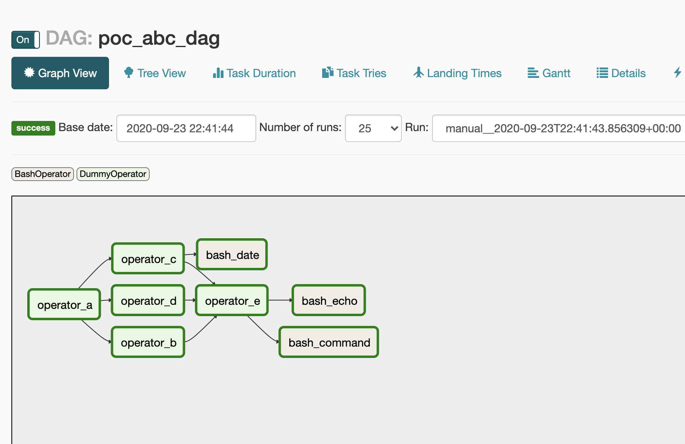
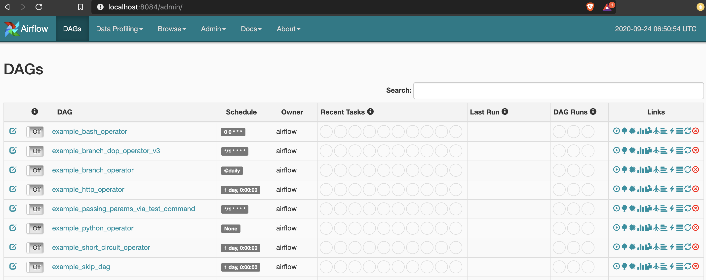
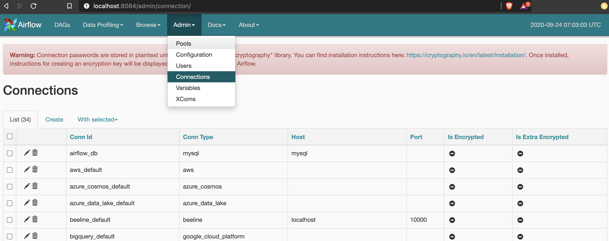
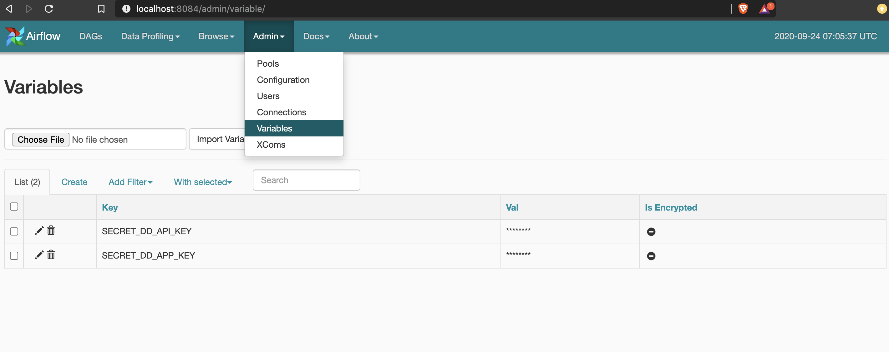
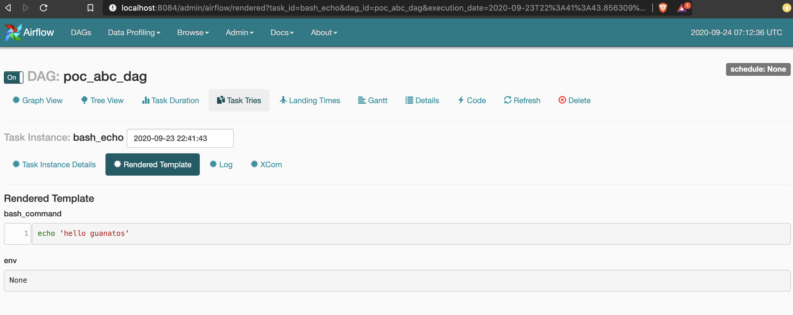
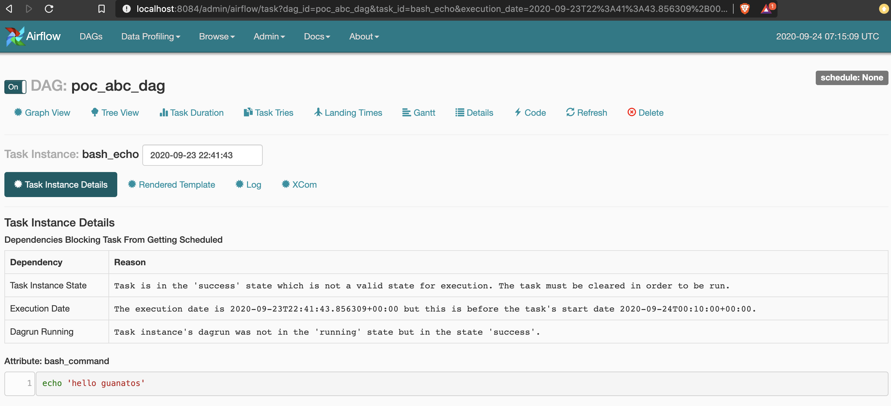
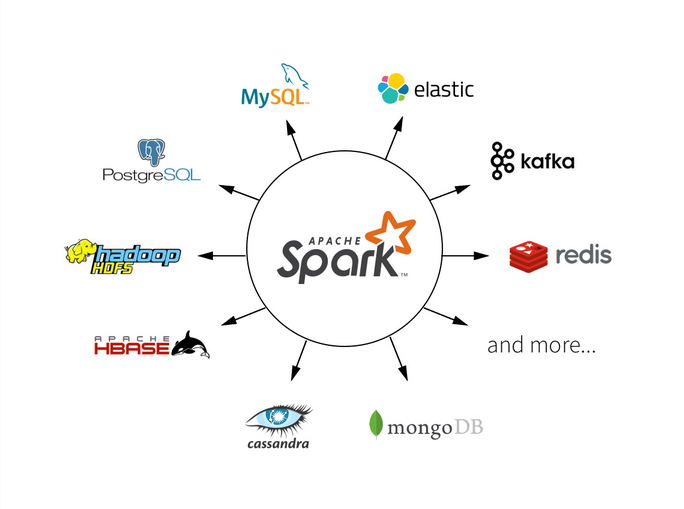

# Apache Airflow - POC  | Orchestration made easy | Hans-on Guide |   

## Overview

This repository is created to show main apache-airflow features, use cases and advantages of using this library,
from installation, overview and some code examples as POC.

## Disclaimer

Here we don't pretend to give a deep explanation about all the components and services of apache airflow,
this is a POC repository which is created to guide people without previous knowledge on apache-airflow by providing 
concrete definitions for the main components, installation instructions and coded examples to show some basics of this 
library.

_Feel free to contribute with more examples._

### What is apache-airflow?

> Python library to define, manage and monitor workflows.

### What is a workflow?

> A set of defined tasks with an specific order (dependencies).

### Relevant Terminology

> - __DAG:__ Set of task (Operators)
> - __Operator:__ A specific task 
> - __Schedule interval:__ Frequency 

### What kind of "process" can be automated by Airflow?

> All processes that does not depends on manual (intermediate) actions/decisions/confirmations and technically possible to be 
> triggered/performed by  bash commands, python functions, db processes.... or any other integration/operator
> (aws, s3, emr, __S3ToGoogleCloudStorageOperator!!!__, azure, gcp, hive, BigQuery, SSH tunnel... and a long list of etc).  





## Enough theory...

### How to install airflow?

Prerequisites: 
- __python__
- __spark__ (this is not required for airflow installation, but for the examples that executed spark jobs).

__Dependencies installation steps__

1. Activate your virtual environment (if it's not created yet, create one based on python 3.7).

    ```shell script
    source {virtual_environment_folder}/bin/activate
    ```

2. Set following env variable to allow virtual environment install apache-airflow

    ```shell script
    export SLUGIFY_USES_TEXT_UNIDECODE=yes
    ```

3. Install dependencies in your virtual environment (see notes about py3 issues with airflow 12 `requirements.txt`)
    ```shell script
    pip install -r requirements.txt
    ```
   
    
### Let's start running our airflow instance

In order to run airflow, we only need to follow next few steps...

Below instructions are considering you are at root project folder

1. Set $AIRFLOW_HOME environment variable

    ```shell script
    export AIRFLOW_HOME=./airflow
    ```

2. Initialize airflow db (after run following command, you'll see more files inside `airflow/` directory, which is now,
our $AIRFLOW_HOME location - defined in previous step).

    ```shell script
    airflow initdb
    ```

3. Open a new session in your terminal to have 2 to work on the following steps.

4. For the new session, repeat step 2.

5. In session 1 -  Start airflow scheduler
    ```shell script
    airflow scheduler
    ```
6. In session 2 - Start airflow webserver (Note: you can use a different port if 8084 is used by other service)
    ```shell script
     airflow webserver -p 8084
    ```
7. Open web browser and navigate to: `http://localhost:8084`


## Main airflow components/commands 

We've ran `airflow scheduler`, `airflow webserver` and `airflow initdb`... but what do they mean? 
...what are they executing?

Well, to cover them quickly we can summarize:
- `scheduler` is a monitoring process for all the dags and their tasks (monitoring status, dependencies, etc) running 
based on `airflow.cfg`.
- `webserver` it provides a UI to manage our DAGs, it also monitors `dag bag` and "promotes" new dags created by users.
- `initdb` airflow stores metadata, dag history, variables, connections and general configuration in a database, 
if not configured, by default it manages in local. `initdb` will initialize our airflow instance 
(it can restart it as well for an existing instance).

Talking about `airflow.cfg`...

Here is the place where we can configure some settings for our airflow instance, such as:

- Loading or not dag examples (included by library)
- scheduler heartbeat interval
- smtp config for email operators

For example...

```editorconfig
[smtp]
smtp_host = your.host.com
smtp_starttls = True
smtp_ssl = False
smtp_user = your_email
smtp_password = given_psw
smtp_port = 587
smtp_mail_from = email_address
``` 

Ok, let's explore airflow webserver....


### Practice - Set Operator Dependencies

Now... let's work with `airflow/dags/abc_dag.py`  and try to set dependencies for `poc_abc_dag` as per first screenshot... 
done? now create 3 more `DummyOperator`s (`operator_x`, `operator_y` and `operator_z`)  all of them should be executed after 
`bash_date` and `bash_command`.

### webserver - dashboard


__Summary of main columns:__
- __second (left to right):__ switch to turn on/off your dag - only turned-on dags can be executed.
- __DAG:__ shown with the dag_id defined in the code
- __Recent tasks:__ last task execution count categorized for each possible state.
- __Last run:__ timestamp for most recent run on UTC.
- __DAG runs:__ historical counts for dag execution by possible status (success, failed, running).
- __Links:__ Here you can run manually your dag (if it's tuned-on), navigate to logs, delete, etc... 

### webserver - admin - connections


This is, as you might image, the place to setup information regarding db connections, but also ssh, spark, etc...

### webserver - admin - variables


These values that you define either on `webserver` or `airflow-cli` are accessible in the code. 
If you want to add a "layer" of security, variables with substrings like `apikey`, `secret`, etc
are automatically masked on webserver.

### webserver - dags - rendered template


Do you want to visualize how your command will look like? Well, this is basically a preview....

### webserver - dags - task instance details


All relevant (and not too relevant) metadata, if you ran your dag but it's not triggered yet, here you can
find the reason... 

## Main Airflow Features


- Pure Python
- Useful UI
- Robust integrations
- Easy to use
- Open Source

## Integrations... a lot of them!

Dont' trust? Take a look: https://airflow.apache.org/

Now, take a look into `resources/pyspark/read_random_words.py`, try to run first it (from terminal as standalone app) 
and then run `airflow/dags/word_count_spark_dag.py` in airflow.

## Cloud Integrations

From: https://airflow.apache.org/docs/stable/integration.html#integration

- Azure: Microsoft Azure
- AWS: Amazon Web Services
- Databricks
- GCP: Google Cloud Platform
- Qubole
 
---

# Practice - POC - Data pipeline

## Summary

This POC try to simulate a small data-pipeline which will trigger spark jobs via spark-submit.

## Problem

Given two data sets with information of shows on Netflix and Prime (links on the last session), we want to get a 
single report with below data:

- top 10 shows (based on IMDB Rating) for Netflix datasource.
- top 15 shows (based on IMDB Rating) for Netflix datasource.  

System should be able to notify in case of success/failed executions.

Bonus: handle those notifications in a third-party service...

### Input details

__Netflix datasource available on:__ `resources/pyspark/sources/tv-shows-netflix.csv`.Preview:

```csv
Titles,Year,Rating,IMDB_Rating,Netflix
Breaking Bad,2008,18+,9.5,1
Game of Thrones,2011,18+,9.3,0
Rick and Morty,2013,18+,9.2,0
```

__Prime datasource available on:__ `resources/pyspark/sources/prime-TV-Shows-Data-set.csv`. Preview:
```csv
S.no.,Name of the show,Year of release,No of seasons available,Language,Genre,IMDb rating,Age of viewers
1,Pataal Lok,2020,1,Hindi,Drama,7.5,18+
2,Upload,2020,1,English,Sci-fi comedy,8.1,16+
3,The Marvelous Mrs. Maisel,2017,3,English,"Drama, Comedy",8.7,16+
4,Four More Shots Please,2019,2,Hindi,"Drama, Comedy",5.3,18+
```

### Considerations

1 - Below list contains the applications (pyspark) to be triggered:
- `top_netflix_shows_identification.py`: extraction of the top 10 netflix shows. Expected input in csv. Expected output in json.
- `top_prime_shows_identification.py`: extraction of the top 10 prime shows. Expected input in csv. Expected output in json.
- `shows_unification.py`: will consume upstream-jobs output, unify in a common schema and write the output with the total 25 shows (as per problem statement). Expected input in json. Expected output in csv. 

2 - Both datasets have different schemas

3 - `prime-TV-Shows-Data-set.csv` contains column names with spaces.

4 - `top_netflix_shows_identification.py` and `top_prime_shows_identification.py` are consuming single file as input, but 
generating output folder with multiple files (spark output), only `*.json` should be considered as input for downstream app.

5 - `shows_unification.py` should be triggered only if both upstream jobs are completed with a `success` status. 

### Apache-spark overview



To understand better what is going to be executed, it's important to know what we're going to execute, in this case `pyspark`.

Take a look into the following files (all the process is documented in the logs):

- `top_netflix_shows_identification.py`
- `top_prime_shows_identification.py`
- `shows_unification.py`


__Solution:__ `airflow/dags/extract_top_shows_dag.py` 


There is no better way to learn than: __coding__. 
Theory is good to know definitions and reasons about "how" the things work, modify `pyspark` file to generate a different report format,
content, etc. modify also the dags to include automatic retries if they fail and include `datadog` feature (hint: you only need to define some variables)
on `extract_top_shows_dag.py`
  

---

__Resources:__ 
- Apache Airflow site:
    - https://airflow.apache.org/
- Data sources: 
    - https://www.kaggle.com/ritesh2000/trending-tv-shows-on-netflix
    - https://www.kaggle.com/nilimajauhari/amazon-prime-tv-shows
